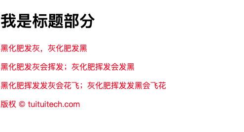
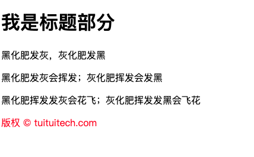
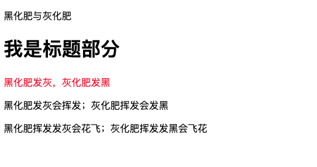

# css 选择器

## 组合选择器

### 后代选择器

会选中`page`里所有的`p`标签，包括孙子元素

```html
<!-- HTML -->
<div class="page">
  <div class="article">
    <h1>我是标题部分</h1>
    <p>黑化肥发灰，灰化肥发黑</p>
    <p>黑化肥发灰会挥发；灰化肥挥发会发黑</p>
    <p>黑化肥挥发发灰会花飞；灰化肥挥发发黑会飞花</p>
  </div>
  <p class="footer">版权 © tuituitech.com</p>
</div>

// CSS: .page p{ font-size: 18px; }
```



### 子元素选择器
只能选择`page`的子元素（孙子元素无法选到）

```html
<!-- HTML -->
<div class="page">
  <div class="article">
    <h1>我是标题部分</h1>
    <p>黑化肥发灰，灰化肥发黑</p>
    <p>黑化肥发灰会挥发；灰化肥挥发会发黑</p>
    <p>黑化肥挥发发灰会花飞；灰化肥挥发发黑会飞花</p>
  </div>
  <p class="footer">版权 © tuituitech.com</p>
</div>

// CSS: .page p{ font-size: 18px; }
```



### 兄弟选择器
选择某个元素相邻的兄弟元素

```html
<!-- HTML -->
<div class="article">
    <p>黑化肥与灰化肥</p>
    <h1>我是标题部分</h1>
    <p>黑化肥发灰，灰化肥发黑</p>
    <p>黑化肥发灰会挥发；灰化肥挥发会发黑</p>
    <p>黑化肥挥发发灰会花飞；灰化肥挥发发黑会飞花</p>
</div>

<!-- h1 + p {
  color: red;
} -->
```
