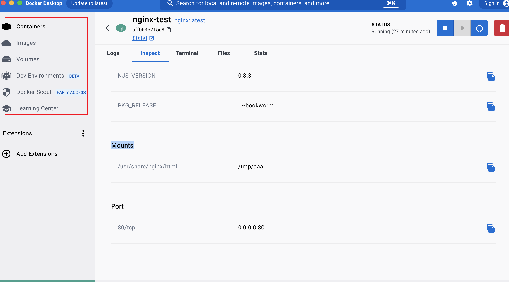
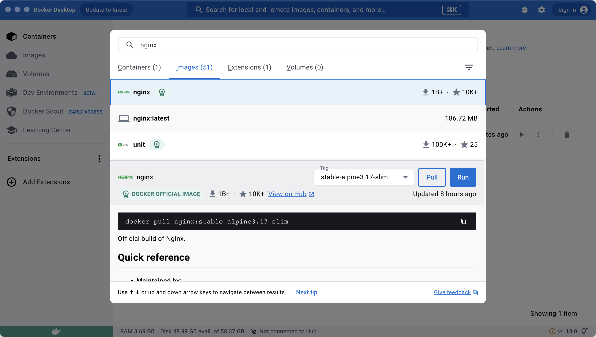
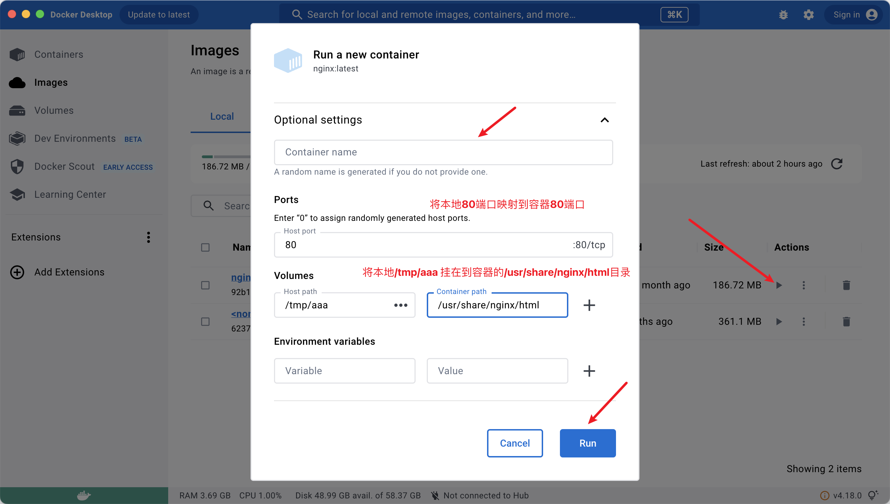
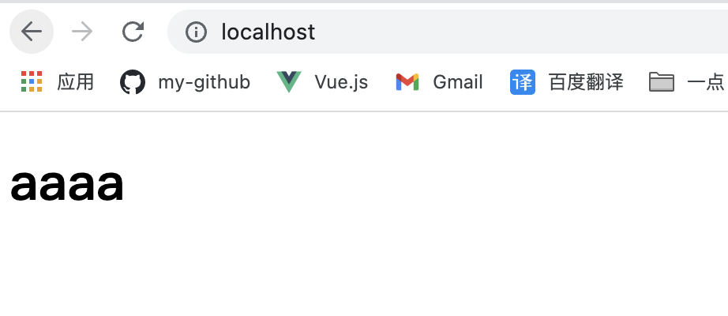
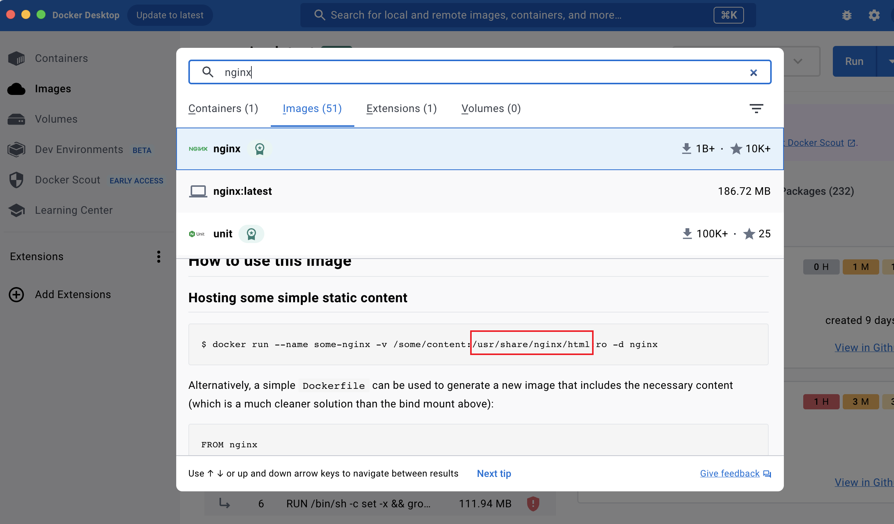
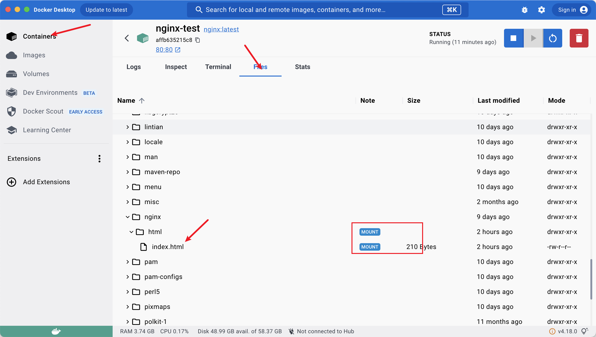

## 下载地址
[下载地址](https://www.docker.com/)，选择`Docker Desktop`，mac注意一下芯片类型
确认是否安装成功
```bash
docker -h
```

## 使用


`images`是本地所有的镜像，`containers`是镜像跑起来的容器。


搜索`nginx`，点击`pull`（<span style="color: red">注意：这一步需要翻墙，不然搜不到</span>）


打开本地的`/tmp/aaa`添加`index.html`
```html
<!DOCTYPE html>
<html lang="en">
<head>
  <meta charset="UTF-8">
  <meta name="viewport" content="width=device-width, initial-scale=1.0">
  <title>Document</title>
</head>
<body>
  <h1>aaaa</h1>
</body>
</html>
```

浏览器打开`http://localhost/`


### 挂载目录



## 命令行操作
已上操作在`Docker Desktop`内很简单，但是到了服务器上，没有`Docker Desktop`这种可视化的东西，就要靠敲命令了。
```bash
# 1、拉取nginx
docker pull nginx:latest
# 2、创建容器
# --name 容器名称
# -p (Ports) 端口映射
# -v (Volumes) 制定数据卷挂载目录
# -e（Environment variables） 指定环境变量
# -d 后台运行
docker run --name nginx-test -p 80:80 -v /tmp/aaa:/usr/share/nginx/html -e KEY1=VALUE1 -d nginx:latest 

# 进入Terminal
# -i terminal 交互的方式运行
# -t tty终端类型
docker exec -it affb635215c88acbffecf021f1f8f21c835b608f3b1a58a91eaca77a75029f25 /bin/bash

# 查看日志
docker logs affb635215c88acbffecf021f1f8f21c835b608f3b1a58a91eaca77a75029f25

# 查看容器详情
docker inspect affb635215c88acbffecf021f1f8f21c835b608f3b1a58a91eaca77a75029f25

```