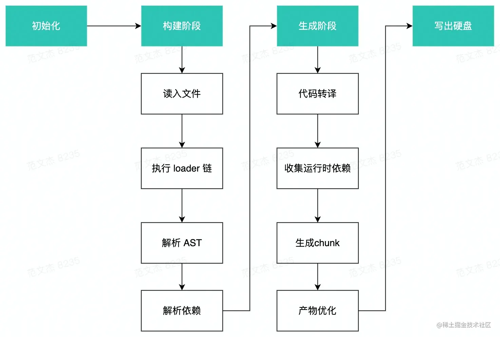

# webpack 基础配置

## 基本配置

```js
const path = require("path");
const htmlWebpaclPlugin = require("html-webpack-plugin");

module.exports = {
  /**
   * 模式：
   * 1、默认为production，会进行一些代码优化，比如代码压缩等
   * 2、development，开发环境
   * 可以通过process.env。NODE_ENV获取当前所处环境
   */
  mode: "production",
  // 单页面配置入库
  entry: "./src/index.js",
  output: {
    filename: "[name].[hash].js", // 文件名
    clean: true, // 每次打包是否清除output目录，类似于clean-webpack-plugin插件的作用
    path: path.resolve(__dirname, "./dist"), // 输出的路径，__dirname，代表当前文件的绝对路径
  },
  plugins: [
    new htmlWebpaclPlugin({
      template: "./public/index.html",
      filename: "index.html", // 打包后的文件名
      minify: true, // 开启压缩
    }),
  ],
};
```

## 多页面配置

```js
module.exports = {
  mode: "production",
  // 多页面配置入口
  entry: {
    // entry里的key（index， login）很重要
    index: "./src/index.js",
    login: "./src/login.js",
  },
  output: {
    /**
     * [name]: 对应上面entry的key（index。login）
     * [hash]: 打包后的文件名带有has值，这个有利于进行缓存
     */
    filename: "[name].[hash].js",
    clean: true, // 每次打包是否清除output目录，类似于clean-webpack-plugin插件的作用
    path: path.resolve(__dirname, "./dist"), // 输出的路径，__dirname，代表当前文件的绝对路径
  },
  plugins: [
    new htmlWebpaclPlugin({
      template: "./public/index.html",
      filename: "index.html", // 打包后的文件名
      minify: true, // 开启压缩
      chunks: ["index"],
    }),[

    ]
    new htmlWebpaclPlugin({
      template: "./public/login.html",
      filename: "login.html",
      minify: true,
      chunks: ["login"], // 指定导入的js文件，和上面的entry的key对应
    }),
  ]
};
```

## hash 作用

web 的缓存一般有以下两种：

- 1、强缓存：主要控制字段有`cache-control`和`expires`，在缓存过期前，再次请求会直接使用缓存数据。
- 2、协商缓存：主要控制字段有`last-modified`（资源最后修改时间）,再次请求时，浏览器会把这个时间给到后端，后端判断时间没变后，响应 304，浏览器继续使用本地缓存。

前端资源缓存优化，一般是这么搞，对于 css、js，图片等，可以使用强缓存，对于入口的`index.html`则不做缓存。  
当我们代码改动后，重新部署，由于在`output.filename`中设置了`[hash]`，当代码改动后，相关的 js，css 文件的文件名就会改变。此时用户刷新网页，由于`index.html`没有做缓存，重新请求回来的`index.html`在加载其它如，css、js 时，由于文件名已变，就会去请求最新的文件资源

## loader

loader 主要作用是代码转换，浏览器是不认识`less`、`scss`、`vue`这种文件，需要转换成浏览器识别的`css`、`js`， loader 就是这个作用

### 处理 css

```js
module.exports = {
  module: {
    rules: [
      {
        test: /\.(css|less)$/,
        // loader执行顺序是从下到上，从右到左，也就说说下面use里面loader的执行顺序是倒着来的
        use: [
          "style-loader", // 把CSS插入到HEAD中
          "css-loader", // 编译解析@import/URL()这种语法
          "postcss-loader", // 设置前缀
          "less-loader", // 把LESS编译为CSS
        ],
      },
    ],
  },
};

// 配置postcss
// 方式一
module.exports = {
  module: {
    rules: [
      {
        test: /\.(css|less)$/,
        // loader执行顺序是从下到上，从右到左，也就说说下面use里面loader的执行顺序是倒着来的
        use: [
          {
            loader: "postcss-loader",
            options: {
              postcssOptions: {
                plugins: [require("autoprefixer")],
              },
            },
          },
        ],
      },
    ],
  },
};

// 方式二：在根目录下新建
// postcss.config.js
module.exports = {
  plugins: [require("autoprefixer")],
};
```

上面的`style-loader`，会把样式注入到 html 中，如果需要抽离出来的话，需要用到以下配置

```js
// yarn add mini-css-extract-plugin -D
const MiniCssExtractPlugin = require('mini-css-extract-plugin');
module.exports = {
    ...
    plugins: [
        ...
        new MiniCssExtractPlugin()
    ],
    ...
    module: {
        rules: [{
            test: /\.(css|less)$/,
            use: [
                // 使用插件中的LOADER代替STYLE方式
                MiniCssExtractPlugin.loader,
                ...
            ]
        }]
    }
};
```

### babel

```js
// ES6代码转ES5代码
// yarn add babel babel-loader @babel/preset-env @babel/core -D

module.exports = {
    ...
    module: {
        rules: [{
            test: /\.js$/,
            use: ['babel-loader'],
            // 编译时，忽略node_modules里的代码
            exclude: /node_modules/
        }]
    }
};


// 根目录下新建babel.config.js
module.exports = {
    presets: [
        "@babel/preset-env"
    ]
};

// 注：上面会把ES6的代码转成ES5的。但是类似Promise这种还是无法使用，需要使用@babel/polyfill，
// @babel/polyfill: 用es5代码的实现方式实现一个Promise
//  yarn add @babel/polyfill --save   (注意这个不要加-D，生产环境也是需要的)

// 入口JS文件引入 (index.js)
import '@babel/polyfill';
```

## webpack打包流程


- 1、从`entry`(入口)处读取代码文件。
- 2、调用`Loader`把代码转换成浏览器能识别的样子[AST](https://juejin.cn/post/6844904035271573511#comment)。递归调用，分析依赖关系。
- 3、模块处理，一般我们写的产物优化项都在这个环节处理，该合并的模块合并，该拆分的拆分，注入运行时代码等，最终输出Chunk集合。
- 4、输出，根据`output`的配置，写出到文件中。